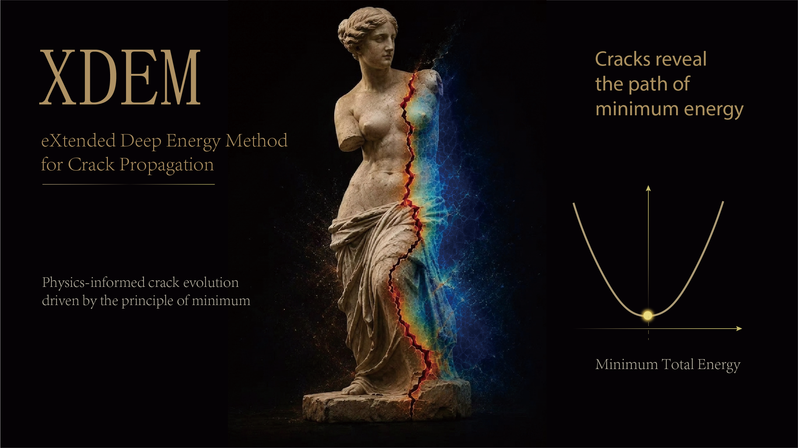

# XDEM: Extended Deep Energy Method

Towards Unified AI-Driven Fracture Mechanics

Official publication: [Nature Communications](https://www.nature.com/articles/s41467-026-76748-1)

This repository implements the **Extended Deep Energy Method (XDEM)**, a unified AI-driven framework for fracture mechanics. XDEM incorporates both displacement discontinuities and crack-tip asymptotics (Williams expansion) in the discrete setting, and flexibly couples displacement and phase fields in the continuous setting, enabling accurate fracture predictions using uniformly distributed, relatively sparse collocation points.

> **Paper**: [Towards unified AI-driven fracture mechanics: the extended deep energy method (XDEM)](https://doi.org/10.1038/s41467-026-76748-1), *Nature Communications* 17, 8492 (2026)



---

## Features

- **Discrete crack model**: Displacement discontinuities (Heaviside step) and crack-tip asymptotics (Williams functions) embedded in the formulation
- **Continuous phase-field model**: Coupled displacement and phase-field modeling
- **Sparse collocation**: No dense collocation near cracks required; uniform distribution suffices
- **Stress intensity factors (SIF)**: Displacement extrapolation and M-integral evaluation
- **Crack growth**: Straight and kinked crack propagation
- **Multiple fracture modes**: Mode I / II / III, mixed-mode, intersecting cracks, crack-inclusion

---

## Project Structure

```
XDEM/
├── XDEM.pdf                  # Published main article
├── supplementary.pdf         # Supplementary information
├── XDEM_graphic_abstract.pdf # Graphical abstract
├── XDEM_graphic_abstract.png # Graphical abstract preview for README
│
├── XDEM_discrete_model/     # Discrete crack model
│   ├── Embedding.py         # Crack surface embedding (displacement discontinuity)
│   ├── Embedding_bit.py     # Crack-tip asymptotics embedding (Williams functions)
│   ├── DENNs.py             # Energy-based PINN solver
│   ├── SIF.py               # Stress intensity factor computation
│   └── examples/            # Numerical examples
│       ├── crack1/          # Mode I crack
│       ├── crack2/          # Mode II crack
│       ├── crack3/          # Mode III crack
│       ├── mixed/           # Mixed-mode crack
│       ├── crack_propagation/   # Crack propagation
│       ├── crack_kinking/       # Crack kinking
│       ├── intersect/           # Intersecting cracks
│       ├── crack_inclusion/     # Crack-inclusion
│       ├── Bittencourt/         # Bittencourt benchmark
│       └── loss_DEM_XDEM/       # DEM vs XDEM comparison
│
└── XDEM_continuous_model/   # Continuous phase-field model
    ├── History_way/         # History strain energy approach
    └── Penalization/        # Penalization approach
```

---

## Requirements

- Python 3.11+
- PyTorch 2.0+
- NumPy
- SciPy
- Matplotlib

---

## Installation

```bash
# Clone the repository
git clone <repository-url>
cd XDEM

# Install dependencies (virtual environment recommended)
pip install torch numpy scipy matplotlib
```

---

## Quick Start

### Discrete model: Mode I crack

```bash
cd XDEM_discrete_model
python examples/crack1/mode1crack_XDEM_tension.py
```

### Discrete model: Crack propagation

```bash
cd XDEM_discrete_model
python examples/crack_propagation/edge_tension_crack_propagation.py
```

### Continuous model: Phase-field fracture

```bash
cd XDEM_continuous_model/History_way
python examples/tension_crack_propagation/Tension_XDEM.py
```

---

## Numerical Examples

| Example Type   | Description                     | Example Script                                      |
|----------------|---------------------------------|-----------------------------------------------------|
| Mode I crack   | Pure tension crack              | `crack1/mode1crack_XDEM_tension.py`                 |
| Mode II crack  | Pure shear crack                | `crack2/mode2crack_XDEM_shear.py`                  |
| Mode III crack | Anti-plane shear                | `crack3/mode3crack_XDEM_tension.py`                |
| Mixed-mode     | Combined Mode I + II loading    | `mixed/mode_mix_crack_XDEM_tension_angle.py`        |
| Crack growth   | Tension-driven crack propagation| `crack_propagation/edge_tension_crack_propagation.py` |
| Crack kinking  | Shear-induced crack kinking     | `crack_kinking/edge_shear_crack_kinking.py`         |
| Intersecting   | Multiple intersecting cracks    | `intersect/intersecting_crack_XDEM.py`              |
| Bittencourt    | Classical edge-crack benchmark  | `Bittencourt/edge_bittencourt_crack_uniform_continue.py` |

---

## Citation

If you find this work useful, please cite:

```bibtex
@article{wang2025xdem,
  title={Towards Unified AI-Driven Fracture Mechanics: The Extended Deep Energy Method (XDEM)},
  author={Wang, Yizheng and Lin, Yuzhou and Goswami, Somdatta and Zhao, Luyang and Zhang, Huadong and Bai, Jinshuai and Anitescu, Cosmin and Eshaghi, Mohammad Sadegh and Zhuang, Xiaoying and Rabczuk, Timon and Liu, Yinghua},
  journal={Nature Communications},
  volume={17},
  pages={8492},
  year={2026},
  doi={10.1038/s41467-026-76748-1}
}
```

---

## License

This project is licensed under the [MIT License](XDEM_discrete_model/LICENSE).

---
